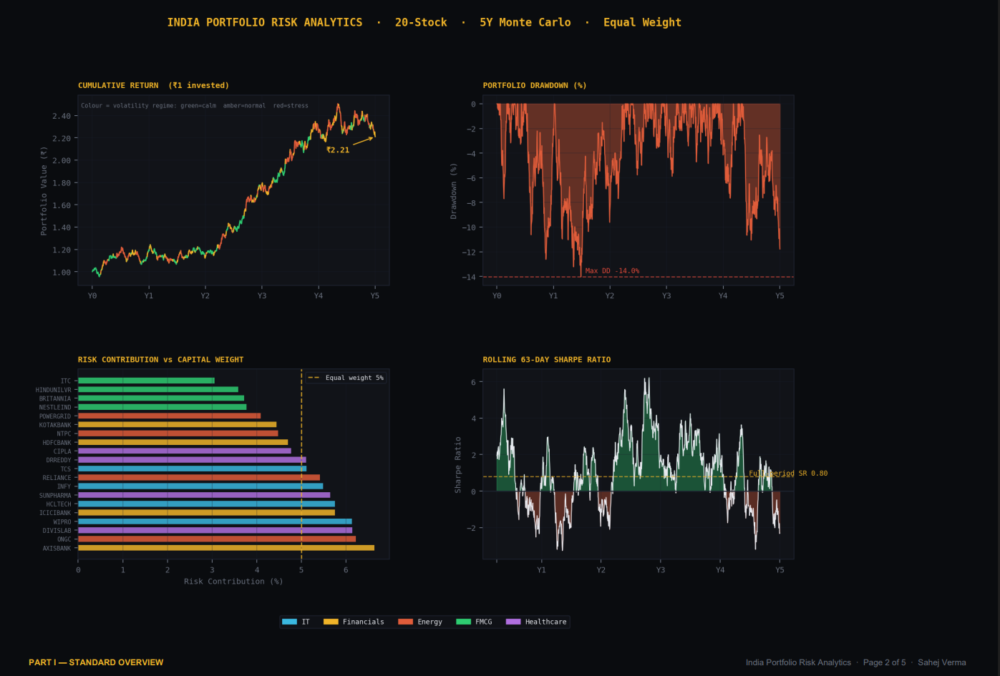
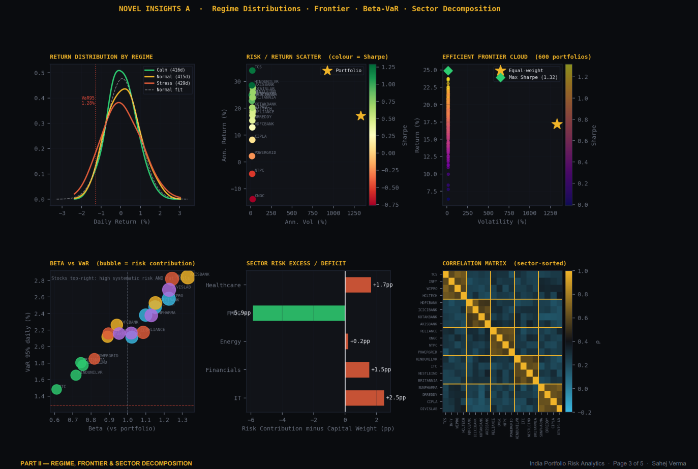
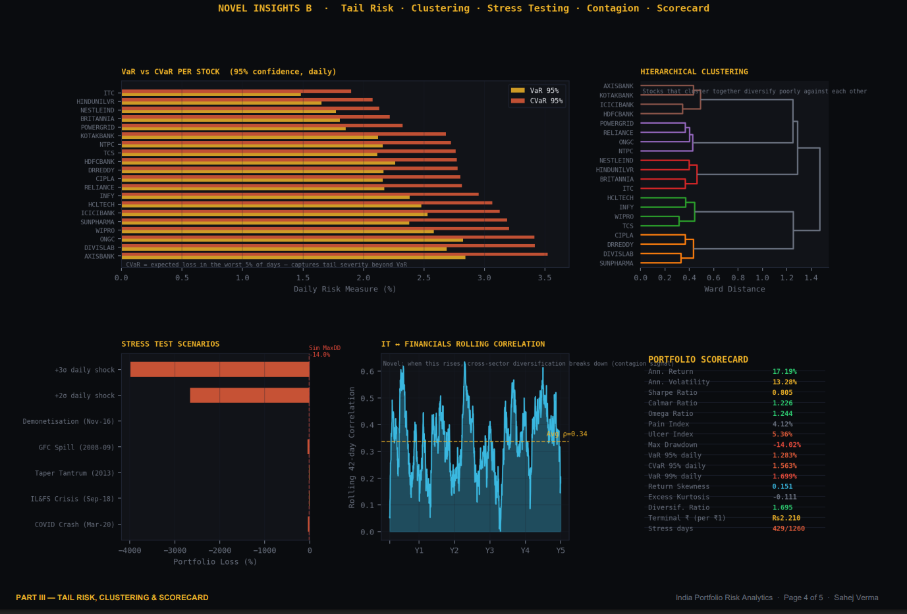

# India Portfolio Risk Analytics

A Monte Carlo-based portfolio risk analytics framework built around a 20-stock NSE universe across IT, Financials, Energy, FMCG, and Healthcare sectors.

## Features

- Monte Carlo simulation using correlated asset paths
- Volatility regime modelling
- VaR & CVaR tail-risk analysis
- Efficient frontier simulation
- Rolling Sharpe and beta diagnostics
- Hierarchical clustering
- Correlation heatmaps
- Higher moment analysis (skewness & kurtosis)
- Vol-of-Vol analytics
- Stress testing framework

## Tech Stack

- Python
- NumPy
- SciPy
- Matplotlib
- ReportLab

## Key Insights

- Equal-weight portfolios do not imply equal risk contribution
- Cross-sector correlations rise sharply during stress regimes
- Traditional volatility metrics often underestimate tail risk
- Diversification weakens dynamically during market instability

## Author

Sahej Verma
Madras School of Economics

## Sample Visuals

### Portfolio Overview

### Risk & Tail Analysis

### Correlation Dynamics

